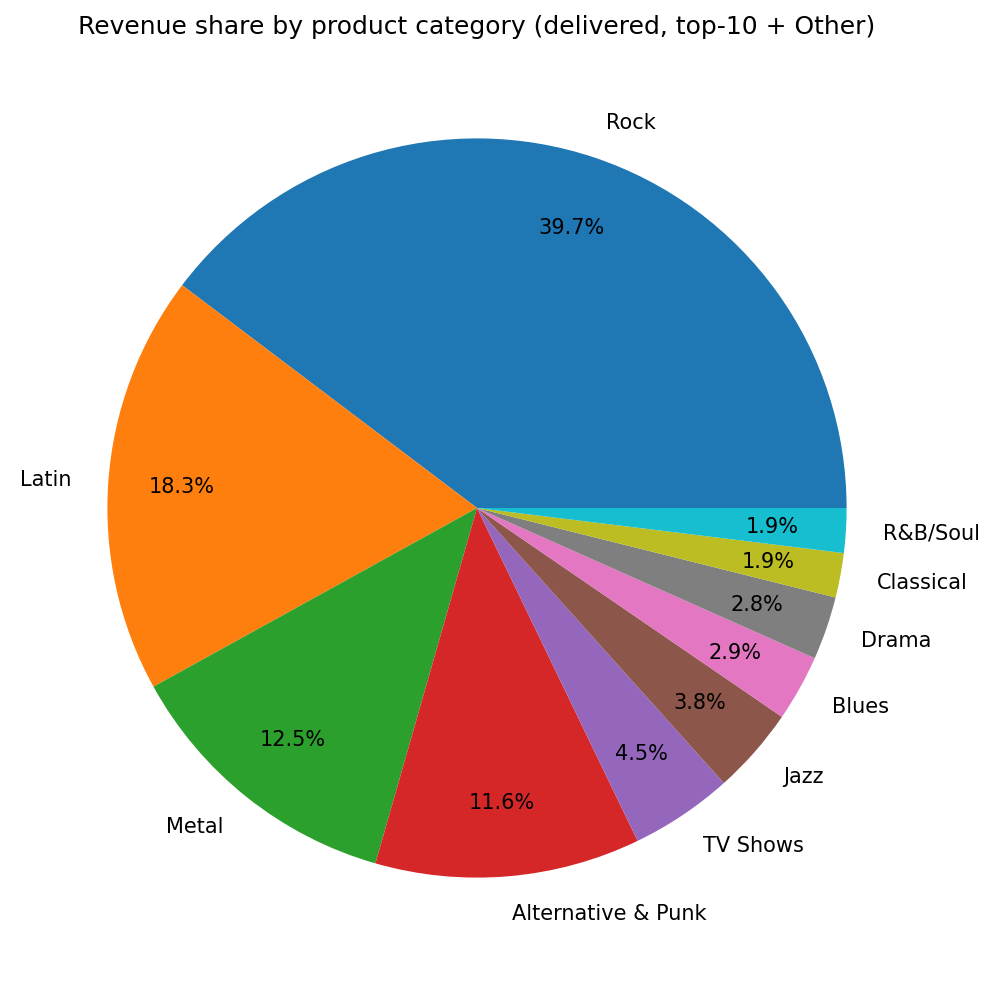
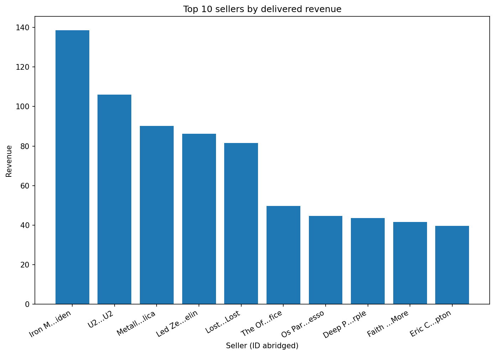
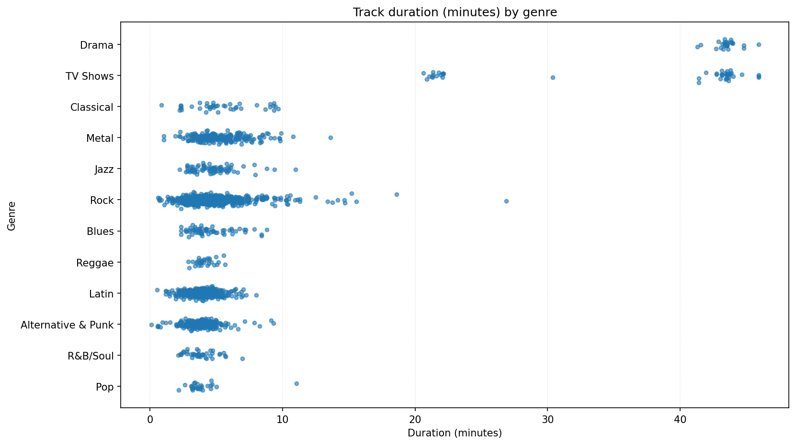

# PULSE — Platform for Unified Learning & Streaming Evidence
> Educational analytics project for the fictional company **PULSE** — an international online retailer of digital music operating across several countries.
---

## Project Overview
This repository contains the complete analytics environment for **PULSE Analytics**, built on top of the **Chinook PostgreSQL dataset** adapted for learning and streaming data.  
It demonstrates an end-to-end analytical pipeline:

- Importing structured datasets (Artists, Albums, Tracks, Genres, Customers, Invoices, etc.)  
- Ensuring data integrity and schema validation  
- Writing advanced SQL queries with **multiple JOINs** for real insights  
- Generating visual analytics using **matplotlib** and **Plotly**  
- Exporting styled reports to Excel via **openpyxl**  

---

## 📊 Main Analytics (Screenshots)
  
  
  

---


## 📦 Dataset
Public **Chinook Database** — a realistic model of a digital media store used here to simulate PULSE’s operational data.  
It includes:
- Artists, Albums, Tracks, Genres  
- Customers, Employees, Invoices, and InvoiceLines  
- Relational links between content creators, clients, and sales operations  

> 📚 Source: [Chinook Database (official sample)](https://github.com/lerocha/chinook-database)

---

## 📈 Key Analytics & Deliverables

### SQL Business Queries
All analytics rely on **2+ table JOINs**, designed to answer meaningful business questions such as:
- Revenue share by genre  
- Top-performing artists by total revenue  
- average revenue by category
- line revenue 2010-1014
- histogram invoice value distribution
- Correlation between price and duration (top genres)

### Static Reporting (matplotlib)
- Six chart types: **pie, bar, horizontal bar, line, histogram, scatter**  
- Automatically saved in `/charts/`  
- Each chart includes titles, axis labels, and legends (if needed)  
- Console report includes number of rows and chart purpose  

### Interactive Visualization (Plotly)
- Dynamic **bar chart with a time slider** (`animation_frame="month"`) to visualize monthly revenue by country  
- Output saved as `/charts/timeslider_revenue_by_country.html`  
- Used during demo to show interactivity  

### Excel Export (openpyxl)
- All query results exported to `/exports/`  
- Features:
  - Frozen header + first column  
  - Filters enabled on all columns  
  - 3-color gradient for numeric columns  
  - Conditional formatting for min/max  
- Example console log:
  ```text
  Created file analytics_data.xlsx, 6 sheets
  Full path: /exports/analytics_data.xlsx

## Libraries Used

This project relies on the following Python libraries:

| Library | Purpose |
|----------|----------|
| **pandas** | Data manipulation, SQL query results handling |
| **matplotlib** | Static chart generation (pie, bar, line, histogram, scatter) |
| **plotly** | Interactive visualizations (time slider animation) |
| **sqlalchemy** | Database connection and query execution |
| **psycopg2** | PostgreSQL driver for SQLAlchemy |
| **openpyxl** | Excel export with conditional formatting and filters |
| **numpy** | Numerical computations and percentile capping |

### Installation

You can install all dependencies with:

pip install pandas matplotlib plotly sqlalchemy psycopg2 openpyxl numpy

## Excel Data Export — Datasets + Summaries + Profiles

This repository includes a rich Excel exporter that pulls data via your existing SQL queries (from `queries.sql`) and writes a single workbook with:


### Files
- `export_excel_datasets.py` — the exporter (uses `analytics.fetch_df()` and `EXPORTS_DIR`)
- `analytics.py` — provides `fetch_df()` and `EXPORTS_DIR`
- `queries.sql` — named SQL blocks used by the exporter

> Note: This section reuses the project’s existing environment; no extra library list here.

### Usage

Export **all** datasets (default output: `exports/analytics_data.xlsx`):
```bash
python export_excel_datasets.py

  

